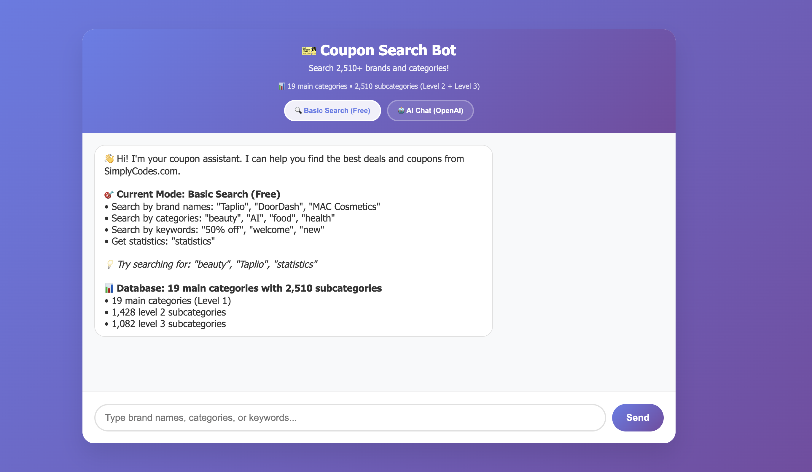

# 🎫 Coupon Companion - AI-Powered Coupon Discovery & Chatbot

A comprehensive web scraper and AI chatbot for extracting and querying coupon codes from SimplyCodes.com across all categories with hierarchical tree structure organization.

## 📸 Demo Screenshots

### 🔍 Basic Search Mode (Free)
*No API key required - Fast keyword search and data browsing*



**Features:**
- ✅ **Free to use** - No OpenAI API key needed
- 🔍 **Keyword search** - Search by brand, category, or keyword
- 📊 **Statistics** - View data overview and counts
- 📋 **Category listing** - Browse all available categories
- 🏷️ **Brand listing** - See all available brands
- ⚡ **Fast response** - Instant results without AI processing

### 🤖 AI Chat Mode (OpenAI)
*Requires OpenAI API key - Natural language conversations and smart recommendations*


**Features:**
- 🤖 **Natural language** - Ask questions in plain English
- 🧠 **Conversational memory** - Maintains context across chat
- 🔍 **Semantic search** - Understands meaning, not just keywords
- 💡 **Smart recommendations** - AI-powered suggestions
- 🎯 **Complex queries** - Handle multi-part questions
- ⚠️ **Requires OpenAI API key** with sufficient credits

## 🚀 Features

### **Web Scraping**
- **Category Discovery**: Automatically discovers all available categories from SimplyCodes.com
- **3-Level Hierarchy**: Organizes data into hierarchical categories (Level 1 → Level 2 → Level 3 → Coupons)
- **Single Category Scraping**: Scrape coupons from a specific category
- **Comprehensive Scraping**: Discover categories + scrape all + create tree structure
- **Anti-Detection**: Built-in stealth features to avoid blocking
- **Retry Logic**: Automatic retry with exponential backoff
- **Data Export**: Saves results to JSON files in both flat and tree structures

### **AI Chatbot**
- **Dual Mode Interface**: Basic search (free) and AI chat (OpenAI-powered)
- **Web Interface**: Modern, responsive web UI with mode toggle
- **FastAPI Backend**: RESTful API for both basic and AI functionality
- **Vector Search**: LangChain-powered semantic search for intelligent queries
- **Conversational Memory**: Maintains context across chat sessions

## 📊 Current Data Status

**✅ Successfully Discovered:**
- **19 Main Categories** (Level 1)
- **2510 Total Categories** (including subcategories)
- **1082 Level 3 Subcategories**
- **Complete AI Categories**: AI Devices, AI Detection, AI Hardware, AI Content Creation, etc.

**Example Categories:**
```
📂 Artificial Intelligence (15 subcategories)
  📄 AI Content Creation
  📄 Business AI Tools
  📄 Conversational Intelligence Software
  📄 Creative AI Tools
  📄 AI Devices
  📄 AI Detection
  📄 AI Hardware
  ... and 8 more

📂 Beauty (8 subcategories)
  📄 Fragrances
  📄 Hair Care
  📄 Makeup
  📄 Nail Care
  📄 Shaving & Hair Removal
  📄 Skin Care
  📄 Tanning
  📄 Tools & Accessories
```

## 🛠️ Usage

### **1. Scraping Commands**

#### Scrape Single Category
```bash
python main.py scrape_single
```
Scrapes the default category (beauty/makeup) and saves results to `data/extracted_coupons.json`.

#### Discover Categories & Create Tree
```bash
python main.py discover_tree
```
Discovers all available categories and creates a tree structure, saving to:
- `data/discovered_categories.json` - All discovered categories (flat list)
- `data/category_tree.json` - Hierarchical tree structure

#### Comprehensive Tree Scraping
```bash
# Scrape all categories
python main.py comprehensive_tree

# Scrape only first 10 categories
python main.py comprehensive_tree 10
```
Performs complete workflow: Discover → Scrape → Create tree structure.

### **2. Chatbot Usage**

#### Start Basic API (Free Mode)
```bash
cd llm
python api_basic.py
```
Provides basic search functionality without OpenAI API requirements.

#### Start AI Chatbot (Requires OpenAI API)
```bash
cd llm
python api.py
```
Provides full AI-powered conversational interface.

#### Access Web Interface
1. Start either API server
2. Open `llm/web_interface.html` in your browser
3. Use mode toggle to switch between Basic Search and AI Chat

## 🏗️ Project Structure

```
coupon_companion/
├── main.py                          # Main CLI entry point
├── scrapers/
│   ├── __init__.py                  # Scraper convenience functions
│   └── simplycodes_scraper.py       # Main scraper class
├── validators/
│   └── coupon_validator.py          # Coupon validation logic
├── llm/
│   ├── assistant.py                 # LangChain AI assistant
│   ├── api.py                       # Full AI API (OpenAI)
│   ├── api_basic.py                 # Basic API (free)
│   ├── web_interface.html           # Web UI
│   ├── test_assistant.py            # AI assistant tests
│   └── test_basic.py                # Basic API tests
├── data/
│   ├── discovered_categories.json   # Discovered categories (flat)
│   ├── extracted_coupons.json       # Single category results
│   ├── comprehensive_coupons.json   # All categories (flat)
│   └── category_tree.json          # All categories (tree)
├── requirements.txt                 # Python dependencies
├── .env                            # Environment variables (API keys)
└── demo_photo.jpg                  # Project demo screenshot
```

## 🔧 API Endpoints

### **Basic API (Free)**
- `GET /health` - Health check
- `GET /search?query=beauty` - Search coupons by keyword
- `GET /categories` - List all categories
- `GET /brands` - List all brands
- `GET /stats` - Get statistics

### **AI API (OpenAI)**
- `POST /chat` - AI-powered conversational chat
- `GET /search?query=beauty` - Semantic search
- `GET /categories` - List all categories
- `GET /brands` - List all brands
- `GET /stats` - Get statistics

## 📋 Output Formats

### **Category Discovery Output**
```json
[
  {
    "title": "AI Content Creation",
    "url": "https://simplycodes.com/category/artificial-intelligence/ai-content-creation",
    "category_path": "/category/artificial-intelligence/ai-content-creation",
    "level": 2,
    "parent_category": "artificial-intelligence"
  }
]
```

### **Tree Structure Output**
```json
{
  "artificial-intelligence": {
    "category_name": "Artificial Intelligence",
    "category_path": "/category/artificial-intelligence",
    "subcategories": {
      "ai-content-creation": {
        "subcategories_name": "AI Content Creation",
        "subcategories_path": "/category/artificial-intelligence/ai-content-creation",
        "url": "https://simplycodes.com/category/artificial-intelligence/ai-content-creation",
        "coupons": [
          {
            "brand": "Taplio",
            "code": "TAPLIO50",
            "description": "50% off",
            "button_index": 0
          }
        ]
      }
    }
  }
}
```

## 🚀 Quick Start

### **1. Environment Setup**
```bash
# Clone repository
git clone https://github.com/Kym1ng/AI-Powered-Coupon-Discovery-Chatbot.git
cd AI-Powered-Coupon-Discovery-Chatbot/coupon_companion

# Create virtual environment
python -m venv venv
source venv/bin/activate  # On Windows: venv\Scripts\activate

# Install dependencies
pip install -r requirements.txt
playwright install
```

### **2. Discover Categories**
```bash
python main.py discover_tree
```

### **3. Start Chatbot**
```bash
# Basic mode (free)
cd llm
python api_basic.py

# AI mode (requires OpenAI API key)
# First, set your OpenAI API key in .env file
echo "OPENAI_API_KEY=your-api-key-here" > .env
python api.py
```

### **4. Access Web Interface**
Open `llm/web_interface.html` in your browser and start chatting!

## 🔑 Configuration

### **Environment Variables**
Create a `.env` file in the project root:
```env
OPENAI_API_KEY=your-openai-api-key-here
```

### **Scraper Settings**
- **Headless Mode**: Default is `True` (runs without browser UI)
- **Delay Between Categories**: Default is 5 seconds
- **Max Categories**: Optional limit for comprehensive scraping
- **Retry Attempts**: Default is 3 attempts with exponential backoff

### **Anti-Detection Features**
- Realistic browser headers and user agent
- Random delays between requests
- Stealth scripts to hide automation indicators
- 403 error detection and bypass attempts

## 📈 Performance

**Current Data Coverage:**
- ✅ **2,510 Total Categories** discovered
- ✅ **1,082 Level 3 Subcategories** found
- ✅ **19 Main Categories** with complete hierarchy
- ✅ **All AI Categories** including previously missing ones

**Scraping Speed:**
- ~5 seconds per category (with anti-detection delays)
- ~2-3 hours for comprehensive scraping of all categories
- Real-time category discovery in ~30 seconds

## 🤖 Chatbot Modes

### **Basic Search Mode (Free)** - See demo above ↑
- ✅ No API key required
- ✅ Fast keyword search
- ✅ Category and brand listings
- ✅ Statistics and data overview
- ✅ Perfect for quick coupon lookups
- ⚡ Instant response time

### **AI Chat Mode (OpenAI)** - See demo above ↑
- 🤖 Natural language queries
- 🧠 Conversational memory
- 🔍 Semantic search capabilities
- 💡 Smart recommendations
- 🎯 Complex multi-part questions
- ⚠️ Requires OpenAI API key with credits
- 💰 Incurs OpenAI usage costs

## 🐛 Troubleshooting

### **Common Issues**

**1. 403 Forbidden Errors**
- The scraper includes automatic retry logic
- If persistent, try running with longer delays

**2. OpenAI API Errors**
- Check your API key in `.env` file
- Ensure you have sufficient credits
- Try using `gpt-3.5-turbo-0125` for cheaper usage

**3. Web Interface Not Working**
- Ensure API server is running (`python api_basic.py` or `python api.py`)
- Check browser console for CORS errors
- Verify API URL in `web_interface.html`

**4. Missing Categories**
- Run `python main.py discover_tree` to refresh category data
- Check `data/discovered_categories.json` for current data

## 📝 Notes

- The scraper includes respectful delays between requests to avoid overwhelming the server
- All scraping is done in headless mode by default for better performance
- Results are automatically saved to JSON files in the `data/` directory
- The scraper handles 403 errors and other blocking attempts gracefully
- Tree structure provides better organization for large datasets
- You can create tree structure from existing data without re-scraping
- The chatbot supports both free basic search and paid AI chat modes

## 🔄 Recent Updates

**Latest Improvements:**
- ✅ Fixed level 3 category discovery
- ✅ Enhanced selectors to find all level 2 categories (with and without level 3)
- ✅ Improved tree organization with proper 3-level hierarchy
- ✅ Added dual-mode chatbot (basic + AI)
- ✅ Created web interface with mode toggle
- ✅ Implemented FastAPI backend for both modes
- ✅ Added comprehensive error handling and retry logic

---

**🎯 Ready to discover the best coupons? Start with `python main.py discover_tree` and then launch your chatbot!**
